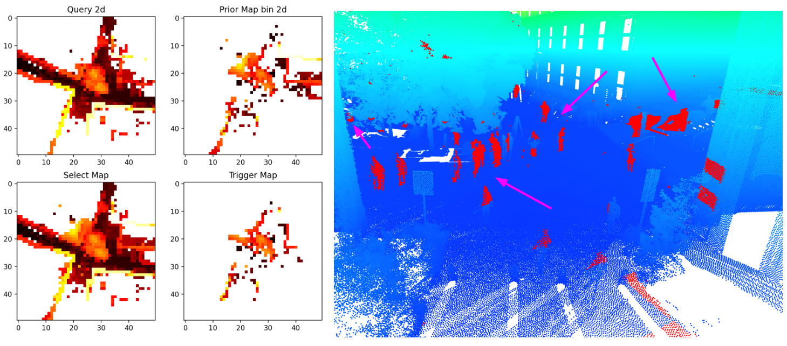

BeautyMap
---

Title: [RA-L'24] BeautyMap: Binary-Encoded Adaptable Ground Matrix for Dynamic Points Removal in Global Maps

Authors: Mingkai JIA, Qingwen ZHANG, ...

Not only limited on the scenarios, point clouds are enough for remove! TESTED SENSOR: Velodyne-16, Velodyne-64, MEMS, Leica BLK360

<!-- To improve the ERASOR in speed and remove theory in math. Check [Kin's notion page](https://www.notion.so/kinzhang/EDOMap-Eliminate-Dynamic-Obstacle-points-in-the-Global-map-ERASOR-6732884af87d430e9405c1e5e5c6ad73) for more detail improvement thinking.


**<u>Test computer and System (Windows and Ubuntu):</u>**

Desktop setting: i9-12900KF, GPU 3090, CUDA 11.3, cuDNN 8.2.1

System setting: Ubuntu 20.04, ROS noetic (**<u>Python 3.8</u>**)

---

Desktop setting: i7-9750H, GPU 1660Ti

System setting: Windows 10 **<u>Python 3.8</u>**

---

Desktop setting: Apple M2

System setting: MacOS 13.0.1 **<u>Python 3.9</u>**

Open3d version must be 15.1 otherwise [issue here](https://github.com/isl-org/Open3D/issues/1421#issuecomment-1402746225)

```bash
brew install libomp
pip3 install -r requirments.txt
pip3 install open3d==0.15.1
```

## Install
install dependencies libraries
```bash
pip install -r requirments.txt
```

run debug data (Three people behind the car):
```bash
python main_rushversion.py
```
ATTENTION: 如果有什么弹出的窗口，是因为现在还在调试阶段，请切换英文输入后，按下键盘：q 即可退出 继续运行后续!!

rush version demo:
Blue is global prior map (Cut a little bit for fast debug), Red is points want to delete, Black is Query Frame Point Cloud




## Others

Some hints about point cloud data set:
```bash
print(f"{points.shape}")
# [1394189,4](lecai) [25380, 4](16-velodyne) 
# 4: (x, y, z, intensity)
```

Issues:
1. [https://stackoverflow.com/questions/52727700/sklearn-kmeans-convergence-warning](https://stackoverflow.com/questions/52727700/sklearn-kmeans-convergence-warning) -->