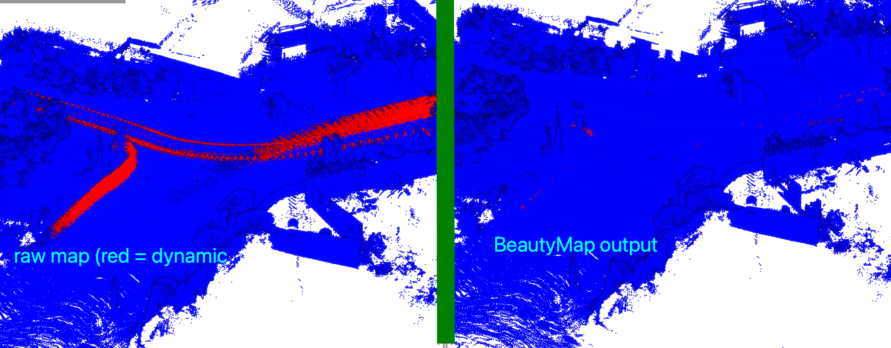

<p align="center">
  <h2 align="center">BeautyMap: Binary-Encoded Adaptable Ground Matrix for Dynamic Points Removal in Global Maps</h2>
  <p align="center">
    <a href="https://github.com/MKJia"><strong>Mingkai Jia</strong></a><sup>1,*</sup>&nbsp;&nbsp;&nbsp;
    <a href="https://kin-zhang.github.io"><strong>Qingwen Zhang</strong></a><sup>2,*</sup>&nbsp;&nbsp;&nbsp;
    <a href="https://github.com/byangw"><strong>Bowen Yang</strong></a><sup>1</sup>&nbsp;&nbsp;&nbsp;
    <a href="http://zarathustr.github.io/"><strong>Jin Wu</strong></a><sup>1</sup>&nbsp;&nbsp;&nbsp;
    <strong>Ming Liu</strong><sup>1</sup>&nbsp;&nbsp;&nbsp;
    <a href="https://www.kth.se/profile/patric"><strong>Patric Jensfelt</strong></a><sup>2</sup>&nbsp;&nbsp;&nbsp;
    <br />
    <sup>*</sup><strong>Co-first author</strong>&nbsp;&nbsp;&nbsp; <sup>1</sup><strong>HKUST</strong>&nbsp;&nbsp;&nbsp; <sup>2</sup><strong>KTH</strong>&nbsp;&nbsp;&nbsp; 
  </p>
</p>

[](https://arxiv.org/abs/2405.07283) [video coming soon] [poster coming soon]. Accepted by RA-L'24.

## 0. Setup
Available in Ubuntu, Windows and MacOS.

[Conda](https://docs.conda.io/projects/miniconda/en/latest/)/[Mamba](https://github.com/mamba-org/mamba) is recommended.
```bash
wget https://repo.anaconda.com/miniconda/Miniconda3-latest-Linux-x86_64.sh
bash Miniconda3-latest-Linux-x86_64.sh

curl -L -O "https://github.com/conda-forge/miniforge/releases/latest/download/Mambaforge-$(uname)-$(uname -m).sh"
bash Mambaforge-$(uname)-$(uname -m).sh
```

Python version tested: 3.8, 3.9, 3.10.
```bash
mamba create -n beautymap python=3.8
mamba activate beautymap
pip install -r requirements.txt
```

## 1. Run

Prepare Data: Teaser data (KITTI 00: 384.4Mb) can be downloaded via follow commands, more data detail can be found in the [dataset section](https://github.com/KTH-RPL/DynamicMap_Benchmark?tab=readme-ov-file#dataset--scripts) or format your own dataset follow [custom dataset section](https://github.com/KTH-RPL/DynamicMap_Benchmark/blob/master/scripts/README.md#custom-dataset).

```bash
wget https://zenodo.org/records/8160051/files/00.zip
unzip 00.zip -d data
```

Run:
```bash
# kitti
python main.py --data_dir data/00 --dis_range 40 --xy_resolution 1 --h_res 0.5

# semi-indoor
python main.py --data_dir data/semindoor --dis_range 10 --xy_resolution 0.5 --h_res 0.2
```

Parameters explanation (Check our paper for more details):
- `range`: from center point to an square.
- `resolution`: resolution of the grid (x,y).
- `h_res`: resolution of the grid (z).



## 2. Evaluation

Please reference to [DynamicMap_Benchmark](https://github.com/KTH-RPL/DynamicMap_Benchmark) for the evaluation of BeautyMap and comparison with other dynamic removal  methods.

[Evaluation Section link](https://github.com/KTH-RPL/DynamicMap_Benchmark/blob/master/scripts/README.md#evaluation)


### Citation

This work was partially supported by the Wallenberg AI, Autonomous Systems and Software Program ([WASP](https://wasp-sweden.org/)) funded by the Knut and Alice Wallenberg Foundation.

Please cite our works if you find these useful for your research.

```
@ARTICLE{10533672,
  author={Jia, Mingkai and Zhang, Qingwen and Yang, Bowen and Wu, Jin and Liu, Ming and Jensfelt, Patric},
  journal={IEEE Robotics and Automation Letters}, 
  title={BeautyMap: Binary-Encoded Adaptable Ground Matrix for Dynamic Points Removal in Global Maps}, 
  year={2024},
  volume={9},
  number={7},
  pages={6256-6263},
  doi={10.1109/LRA.2024.3402625}}

@inproceedings{zhang2023benchmark,
  author={Zhang, Qingwen and Duberg, Daniel and Geng, Ruoyu and Jia, Mingkai and Wang, Lujia and Jensfelt, Patric},
  booktitle={IEEE 26th International Conference on Intelligent Transportation Systems (ITSC)}, 
  title={A Dynamic Points Removal Benchmark in Point Cloud Maps}, 
  year={2023},
  pages={608-614},
  doi={10.1109/ITSC57777.2023.10422094}
}
```
